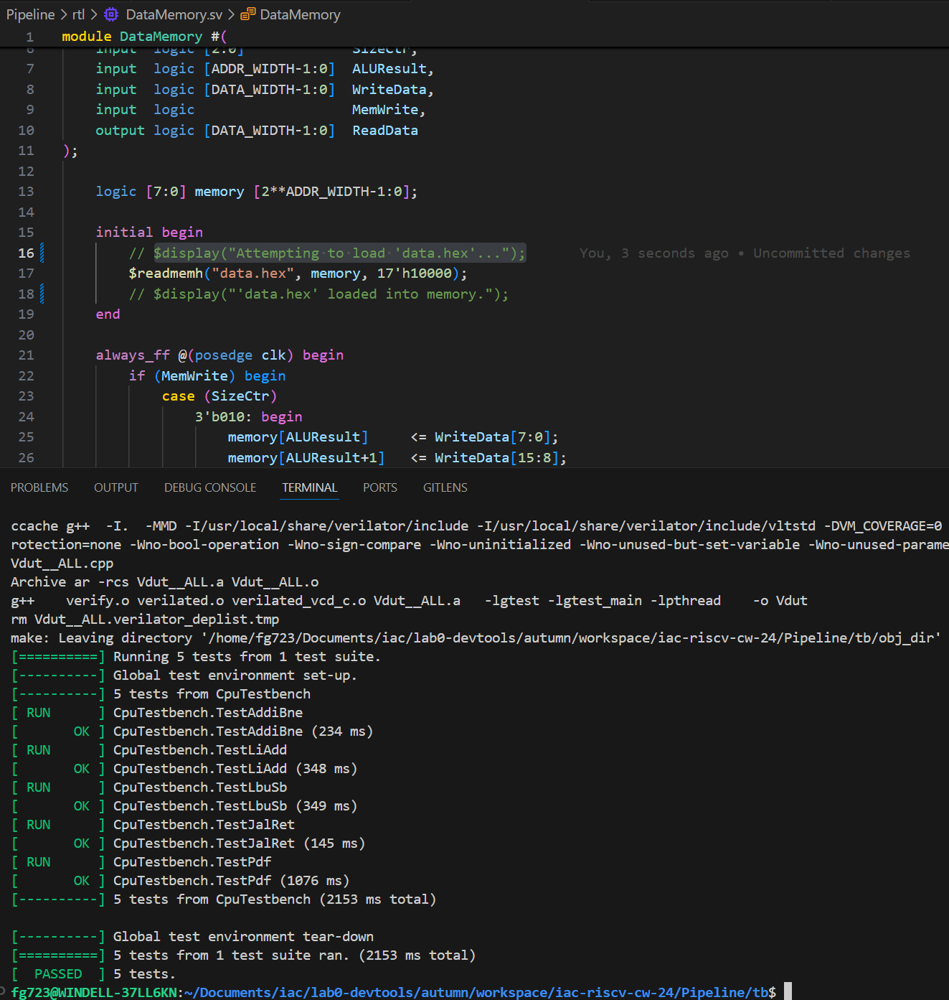
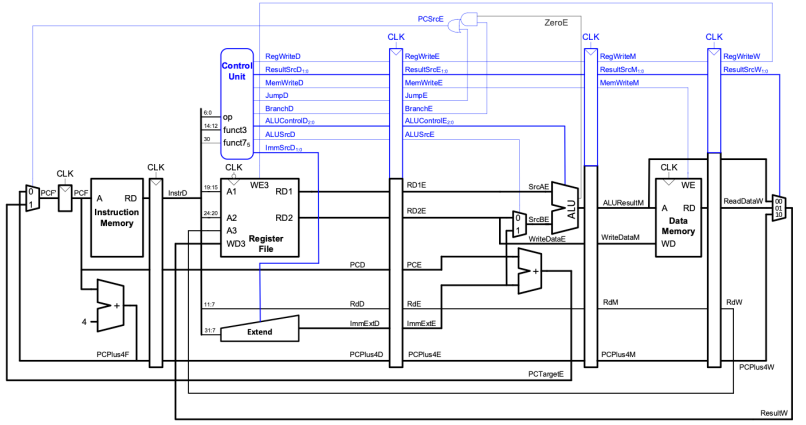
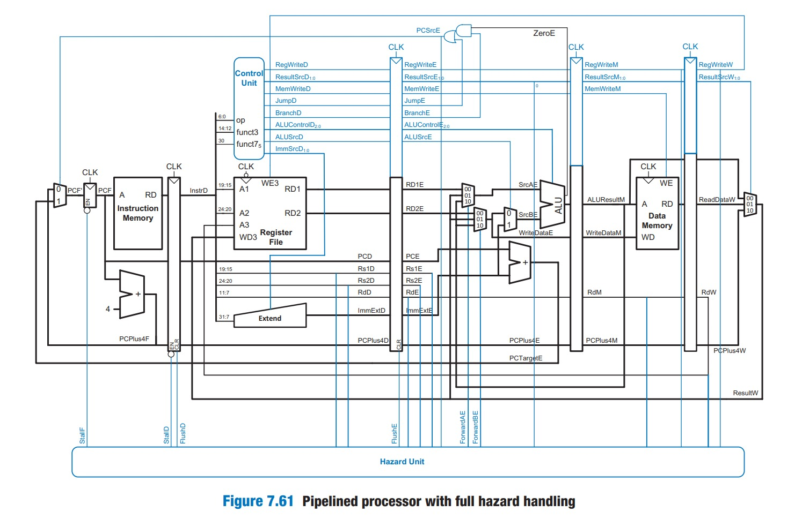

# RISC-V RV32I Processor Coursework  

### Personal Statement of Contributions  
**Flavio Gazzetta**  

---
---

## Overview  

During my time working on this project I initially devoted my work towards working on both the single cycle and especially a 5 stage pipelined CPU. For the single-cycle I made and tested various componets, these components were the DataMemory, the Register file, the ALU, the PC and various multiplexers. After having completed this I focused my time on the pipelining cpu for which I made many new components including a hazard unit (would decide when to flush, stall and use forwarding), hazard multiplexers (to implement forwarding), registers which would separate the stages Fetch->Decode, Decode->Execute, Execute->Memory, Memory->WriteBack, a mux which would allow the implementation of the JALR instruction and many more. 

---
---

## SingleCycle 

When considering the single cycle CPU, my work on it consisted on making, debugging and editing various components starting from ones from lab4 and augmenting them in order to better fit to the more advanced CPU. Strarting with the  

---
---

## Pipeline

For the Pipeline CPU I made various changes both to separate the stages Fetch, Decode, Execute, Memory and WriteBack, and to various components in order to adjust them to these stages. First of all I added 4 regsters to separate the stages [Fetch -> Decode](Pipeline/rtl/PRegFetch.sv), [Decode -> Execute](Pipeline/rtl/PRegDecode.sv), [Execute -> Memory](Pipeline/rtl/PRegExecute.sv), [Memory -> WriteBack](Pipeline/rtl/PRegMemory.sv). Initially these only rook the inputs from one stage and passed them to the next after a clock tick, at first here I thought it would be a good idea to give these registers a memory, but later I decide to make them act like 32-bit flip flops. After having made these I edited the [control unit](Pipeline/rtl/controlUnit.sv) (specifically making changes in the [aluDecoder.sv](Pipeline/rtl/aluDecoder.sv) and the [mainDecoder.sv](Pipeline/rtl/mainDecoder.sv)) and added outputs including JumpD to decide when I would Jump, BranchD to decide when I would Branch, I then used the component [PCMuxSelect](Pipeline/rtl/mainDecoder.sv) to AND the zeroE output of the [Branch Unit](Pipeline/rtl/branchUnit.sv) with JumpE (JumpD output after passing through the Decode -> Execute stage), and then OR'ed the output of this AND gate with BranchE. I removed the PCsrc Output and then changed my ReultSrc output from 1 to 2 bits, this is because I wanted the [result Mux](Pipeline/rtl/resultMux.sv) (register in the in the writeback stage of the alu) to select between 3 values (where I made the 4th input be a default 00 as this would never be used). The reason for now using a 4 input mux was that i combined 2 muxes from the single-cycle stage (resultMux and JumpMux) to better follow the schematic given to us and to keep everything as compact as possible. I also changed ALUControl from 3 to 4 bits, this change was made in order to allow the [alu](Pipeline/rtl/alu.sv) and [Branch Unit](Pipeline/rtl/branchUnit.sv) to act separateley, as with 3 bits their operations would overlap in the same stage and leed to errors. Hence, due to this change in ALUControl I changed the bit allocation in the [Branch Unit](Pipeline/rtl/branchUnit.sv) and [alu](Pipeline/rtl/alu.sv) (adding adding a 1 as MSB for the [Branch Unit](Pipeline/rtl/branchUnit.sv) and a 0 for the [alu](Pipeline/rtl/alu.sv)). I also added a Jalrsrc output to act as a select bit for a [Jalr Mux](Pipeline/rtl/JalrMux.sv) located in the execute stage which would select between the last program counter value or the last register1 value to be passed into the [extend PC component](Pipeline/rtl/extendPC.sv) component which would add the immediate value in the execute stage with the value passed on by the [Jalr Mux](Pipeline/rtl/JalrMux.sv), with the ouput of this component being the other input in the [PC Register](Pipeline/rtl/pcReg.sv). Of course, even with all these changes (and other minor ones) the cpu could still not pass any of the 5 tests given to us, this was because I was yet to add the [Hazard Unit](Pipeline/rtl/HazardUnit.sv) and related [HazardMux'es](Pipeline/rtl/HazardMux.sv). I made the [Hazard Unit](Pipeline/rtl/HazardUnit.sv) able to perfrom 3 different types of actions: Flushing (uses outputs FlushD and FlushE to set all the ouputs of the [Fetch -> Decode](Pipeline/rtl/PRegFetch.sv) and [Decode -> Execute](Pipeline/rtl/PRegDecode.sv) registers to 0), Stalling (uses the ouput stall to prevent the values in the [PC Register](Pipeline/rtl/pcReg.sv) and [Fetch -> Decode](Pipeline/rtl/PRegFetch.sv) registers to pass on to the next ones) and Forwarding (uses the ouputs ForwardAE and ForwardBE to select between the value of register1 and regitsr2 ouputs of the [register file](Pipeline/rtl/regfile.sv) in the execute stage, the value of the aluresult in the memory stage and the value of the result which is in the writeback stage and ). In my HazardUnit code, forwarding, stalling, and flushing are implemented to resolve hazards as follows:

Forwarding resolves data hazards by bypassing results from later stages (Memory or Writeback) to the Execute stage. For Source A (ForwardAE), the logic is as follows:

```systemverilog
if (RegWriteM && (destReg_m != 0) && (destReg_m == Rs1E)) begin
    ForwardAE = 2'b10;  // Forward from Memory stage
end else if (RegWriteW && (destReg_w != 0) && (destReg_w == Rs1E)) begin
    ForwardAE = 2'b01;  // Forward from Writeback stage
end else begin
    ForwardAE = 2'b00;  // No forwarding
end
```

Similarly, ForwardBE handles forwarding for Source B by checking Rs2E. This ensures the [alu](Pipeline/rtl/alu.sv) in the Execute stage receives up-to-date data directly from the pipeline. Stalling resolves load-use hazards, where an instruction requires data from a load still in the Memory stage. If a load instruction in the Execute stage (memoryRead_e) has a destination register (RdE) that matches either source register in the Decode stage (Rs1D or Rs2D), the pipeline is stalled as follows:
```systemverilog
if (memoryRead_e && ((RdE == Rs1D) || (RdE == Rs2D))) begin
    stall = 1'b1;
end else begin
    stall = 1'b0;
end
```
When stall is asserted, the Fetch and Decode stages are frozen, and the Execute stage is cleared using:
```systemverilog
if (stall) begin
    FlushE = 1'b1;  // Clear Execute stage to avoid incorrect operation
end
```
Flushing resolves control hazards (e.g., branches or jumps) by discarding incorrect instructions fetched after a mispredicted branch or jump. If a branch condition (zero_hazard) or jump (jump_hazard) is detected, flushing is applied as follows:
```systemverilog
if (zero_hazard || jump_hazard) begin
    FlushD = 1'b1;  // Clear Decode stage
    FlushE = 1'b1;  // Clear Execute stage
end
```
This ensures any incorrectly fetched instructions are removed. 

In order to implement flush and stall I also changed the registers between [Fetch -> Decode](Pipeline/rtl/PRegFetch.sv) and [Decode -> Execute](Pipeline/rtl/PRegDecode.sv), only allowing the values to pass from Fetch to Decode when stall = 0 is high and making all outputs of <= 0 when FlushD and FlushE respectivley.

After having added all these features and having done a lot of debuggin I tested the 5 cpu tests and got the following results:

### Testing & Results

##### Pipeline 5 tests


 
---


Initial Pipeline - No Hazard Unit:



Finished Pipelined - Full hazard unit implemented: 



---
---

## Single Cycle - Added or edited Components

---

### Program Counter

The pcReg module implements a program counter (PC) register with increment and update logic:

Increment Logic:

```systemverilog
Copy code
always_comb begin
    incPC = pc + OFFSET;
end
```
This block continuously calculates the incremented PC (incPC) by adding the fixed OFFSET (in my case 4) to the current pc. It uses combinational logic to ensure incPC updates immediately whenever pc changes.

PC Update Logic:

```systemverilog
Copy code
always_ff @ (posedge clk)
    if (rst)
        pc <= 32'hBFC00000;
    else
        pc <= nextPC;
```

This block updates the pc on the positive edge of the clock. If the reset (rst) signal is active, pc is initialized to 32'hBFC00000, a common boot address. Otherwise, pc is updated to the value of nextPC, supporting jumps or branch instructions.

Purpose: The module ensures incPC provides the address for sequential execution (pc + OFFSET), while pc can be reset or updated to any address (nextPC). This design supports both normal program flow and exceptions like resets or jumps.

#### Block Diagram

##### Links to Module  

[pcReg.sv](rtl/pcReg.sv)

[pcMux.sv](rtl/pcMux.sv)

#### Most Relevant Commits

1) [first version of counter](https://github.com/opnuub/Lab4/commit/66f45f5c08d823b52e3ff4d20c09211cb3410bed)

2) [first version of counter](https://github.com/opnuub/Lab4/commit/66f45f5c08d823b52e3ff4d20c09211cb3410bed)

3) [changed PCreg and top to include combinational logic inside of PC](https://github.com/opnuub/Lab4/commit/602bbcf9fe90792f2bb1aef4e45129d38d9b2730)

---

### ALU

The alu module implements an Arithmetic Logic Unit (ALU) that performs various operations based on a control signal (aluControl):

Operation Logic:

```systemverilog
always_comb begin
    case (aluControl)
        3'b000: aluResult = srcA + srcB;                         // Addition
        3'b001: aluResult = srcA - srcB;                         // Subtraction
        3'b010: aluResult = srcA & srcB;                         // Bitwise AND
        3'b011: aluResult = srcA | srcB;                         // Bitwise OR
        3'b100: aluResult = srcB;                                // Load Upper Immediate (lui)
        3'b101: aluResult = ($signed(srcA) < $signed(srcB)) 
                             ? 32'b1 : 32'b0;                   // Set Less Than (signed)
        3'b110: aluResult = srcA << srcB[4:0];                   // Logical Left Shift
        3'b111: aluResult = srcA >> srcB[4:0];                   // Logical Right Shift
    endcase
end
```
This block uses a case statement to determine the ALU operation based on the 3-bit control signal aluControl. It calculates the result (aluResult) as follows:
3'b000 and 3'b001 perform addition and subtraction.
3'b010 and 3'b011 perform bitwise operations (AND and OR).
3'b100 simply outputs srcB, representing a "Load Upper Immediate" operation.
3'b101 compares the signed values of srcA and srcB and sets aluResult to 1 if srcA < srcB, otherwise 0.
3'b110 and 3'b111 perform logical shifts left and right, using the lower 5 bits of srcB to specify the shift amount.
Purpose:

The module implements a versatile ALU for use in a CPU. It supports arithmetic operations, bitwise logic, shifts, and comparisons, all determined by the aluControl signal. These operations are fundamental for executing instructions in most instruction set architectures.

#### Block Diagram

#### Link to Module  

[alu.sv](rtl/alu.sv)

#### Most Relevant Commits

1) [added ALU version 1](https://github.com/opnuub/iac-riscv-cw-16/commit/fc9c426b4c8af0576de1129055d2b3582990d3de)

2) [Added mux connecting to ALU](https://github.com/opnuub/iac-riscv-cw-16/commit/56752057c5c8f5cf7abfee144f58caf270d2d0e9)

3) [upadtes to ALU including singed and unsigned smaller than](https://github.com/opnuub/iac-riscv-cw-16/commit/29db9d2eeab6de3a390bccd528c7f5b89459afd2)

4) [added unchange SrcB to to allow for lui](https://github.com/opnuub/iac-riscv-cw-16/commit/4e4d1629e8dce89d05d143472dde3d0a2a077e4e)

5) [changed ALU back to 3 bits](https://github.com/opnuub/iac-riscv-cw-16/commit/5a6290178d83b32d25e95a0dfc2205948b976b7c)

this was then changed further by Cole for integration

---

### RegFile

This module provides essential register file functionality for a CPU:

Reads: Outputs the values of two registers (rs1 and rs2) as operands for computations.
```verilog
always_comb begin
        ALUop1 = rom_array[rs1]; // Read first operand
        regOp2 = rom_array[rs2]; // Read second operand
end
```

Writes: Updates a specified register (rd) with a value (ALUout) if RegWrite is enabled. Also Continuously updates a0 to reflect the value of register x10, used for the 5 cpu tests.
```systemverilog
always_ff @(posedge clk) begin
        if (RegWrite && rd != 5'd0)
            rom_array[rd] <= ALUout;  // Write to register
        a0 <= rom_array[5'd10];
end
```

#### Block Diagram

#### Link to Module 

[regFile.sv](rtl/regFile.sv)

#### Most Relevant Commits

1) [Added RegFile version 1](https://github.com/opnuub/iac-riscv-cw-16/commit/deb3dc83c7be3d490ad1d975ee7e690f2ce03e91)

this was later changed by cole during implementation

---

### DataMemory

The dataMemory module implements a memory unit for reading and writing data in a CPU, with support for byte-addressable memory and variable data sizes.

Memory Initialization:

```systemverilog
logic [7:0] memory [2**ADDR_WIDTH-1:0];

initial begin
    $readmemh("../tb/data.hex", memory, 17'h10000);
end
```
The memory array represents a byte-addressable memory space with 2^ADDR_WIDTH locations, each 8 bits wide.
At startup, memory is initialized with data from an external file (data.hex), starting at address 0x10000.
Write Logic:

```systemverilog
always_ff @(posedge clk) begin
    if (MemWrite) begin
        case (SizeCtr)
            3'b010: begin
                memory[ALUResult]     <= WriteData[7:0];
                memory[ALUResult+1]   <= WriteData[15:8];
                memory[ALUResult+2]   <= WriteData[23:16];
                memory[ALUResult+3]   <= WriteData[31:24];
            end
            3'b001: begin
                memory[ALUResult]     <= WriteData[7:0];
                memory[ALUResult+1]   <= WriteData[15:8];
            end
            3'b000: begin
                memory[ALUResult]     <= WriteData[7:0];
            end
            default: ;
        endcase
    end
end
```
Writes occur on the positive edge of the clock when MemWrite is active.
The SizeCtr signal determines the size of the write:
3'b010: Writes a full word (32 bits) across 4 memory locations.
3'b001: Writes a halfword (16 bits) across 2 locations.
3'b000: Writes a single byte (8 bits).
The memory address is specified by ALUResult.
Read Logic:

```systemverilog
always_comb begin
    case (SizeCtr)
        3'b010: begin
            ReadData = {memory[ALUResult+3], memory[ALUResult+2], memory[ALUResult+1], memory[ALUResult]};
        end
        3'b001: begin
            ReadData = {{16{memory[ALUResult+1][7]}}, memory[ALUResult+1], memory[ALUResult]};
        end
        3'b000: begin
            ReadData = {{24{memory[ALUResult][7]}}, memory[ALUResult]};
        end
        3'b100: begin
            ReadData = {24'b0, memory[ALUResult]};
        end
        3'b101: begin
            ReadData = {16'b0, memory[ALUResult+1], memory[ALUResult]};
        end
        default: ReadData = 32'b0;
    endcase
end
```
The always_comb block reads data based on the SizeCtr signal:
3'b010: Reads a full word (32 bits) from 4 memory locations.
3'b001: Reads a halfword (16 bits) with sign extension from 2 locations.
3'b000: Reads a single byte (8 bits) with sign extension.
3'b100 and 3'b101: Perform unsigned reads of 1 byte and 2 bytes, respectively.
Sign extension fills higher bits with the most significant bit of the data if signed, or with zeros if unsigned.

#### Block Diagram

#### Link to Module

[dataMemory.sv](rtl/dataMemory.sv)

#### Most Relevant Commits

1) [Data memory](https://github.com/opnuub/iac-riscv-cw-16/commit/ddabfb75227940ec05f503a63af4c198829b5f99)

---
---

## Pipelin - Added or Edited Components

---

## Pipeline Registers

#### Blocks Diagram

#### Links to Modules

[PRegFetch.sv](Pipeline/rtl/PRegFetch.sv)

[PRegDecode.sv](Pipeline/rtl/PRegDecode.sv)

[PRegExecute.sv](Pipeline/rtl/PRegExecute.sv)

[PRegMemory.sv](Pipeline/rtl/PRegMemory.sv)

#### Most Relevant Commits

1) [Improved Pipeline Registers](https://github.com/opnuub/iac-riscv-cw-16/commit/72aea873a82f6d3353513419fee9e28bb456142d)

2) [implemented the Jalr instruction by using a seperate mux](https://github.com/opnuub/iac-riscv-cw-16/commit/aa623c2f9ed204c58805c8cf299f0bddc0a6dc05)

---

## Control Unit

##### main Decoder main changes

Added sizeSrc for Load/Store Instructions
Specifies the size of data (byte, halfword, word) based on funct3.

```systemverilog

output  logic [2:0] sizeSrc; // Size control for load/store instructions

case (funct3)
    3'b000: sizeSrc = 3'b000; // Byte
    3'b001: sizeSrc = 3'b001; // Halfword
    3'b010: sizeSrc = 3'b010; // Word
endcase
```
Expanded resultSrc to 2 Bits
Allows distinction between ALU (00), memory (01), and PC (10) results.

```systemverilog
output  logic       resultSrc; // 1-bit signal
```
output  logic [1:0] resultSrc; // Expanded to 2 bits
Added Separate Branch Signal
Differentiates branch determination from pcSrc.

```systemverilog
output logic Branch; // Indicates branch instruction
```

Branch = 1; // Set for branch instructions
Explicit Handling for funct3 in Load/Store
Decodes funct3 for load/store size control.

```systemverilog
case (funct3)
    3'b000: sizeSrc = 3'b000; // Load Byte
    3'b001: sizeSrc = 3'b001; // Load Halfword
    3'b010: sizeSrc = 3'b010; // Load Word
endcase
```

##### ALU Decoder main changes

Increased the width of aluControl to 4 bits for additional operations.
```systemverilog
// Original:
output  logic [2:0] aluControl;

// New:
output  logic [3:0] aluControl;
```

Added explicit handling for branch operations (aluOp = 2'b01).
```systemverilog
2'b01: begin
    case (funct3)
        3'b000: aluControl = 4'b1000; // beq
        3'b001: aluControl = 4'b1001; // bne
        3'b100: aluControl = 4'b1100; // blt
        3'b101: aluControl = 4'b1101; // bge
        3'b110: aluControl = 4'b1110; // bltu
        3'b111: aluControl = 4'b1111; // bgeu
        default: aluControl = 4'b0000; // Default to add
    endcase
end
```
Expanded the set of ALU operations, including li, xor, and additional R-type instructions.

```systemverilog
2'b10: begin
    case (funct3)
        3'b000: aluControl = (opfunct7 == 2'b11) ? 4'b0001 : 4'b0000; // sub/add
        3'b001: aluControl = 4'b0110; // sll
        3'b010: aluControl = 4'b0101; // slt
        3'b011: aluControl = 4'b0100; // li
        3'b100: aluControl = 4'b0010; // xor
        3'b101: aluControl = 4'b0111; // srl
        3'b110: aluControl = 4'b0011; // or
        3'b111: aluControl = 4'b0010; // and
        default: aluControl = 4'b0000; // Default to add
    endcase
end
```
#### Blocks Diagrams

#### Links to Modules

[controlUnit.sv](Pipeline/rtl/controlUnit.sv)

[aluDecoder.sv](Pipeline/rtl/aluDecoder.sv)

[mainDecoder.sv](Pipeline/rtl/mainDecoder.sv)

#### Most Relevant Commits

1) [Improved Pipeline Registers](https://github.com/opnuub/iac-riscv-cw-16/commit/72aea873a82f6d3353513419fee9e28bb456142d)

2) [implemented the Jalr instruction by using a seperate mux](https://github.com/opnuub/iac-riscv-cw-16/commit/aa623c2f9ed204c58805c8cf299f0bddc0a6dc05)

---

## Additional Features and Testing  

### Features Added  

---

## potential improvements

## Additional Comments 