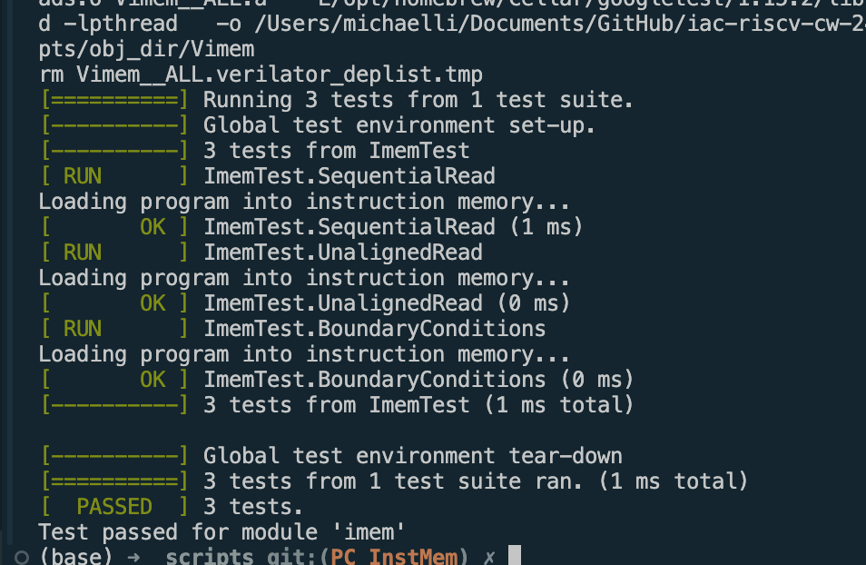
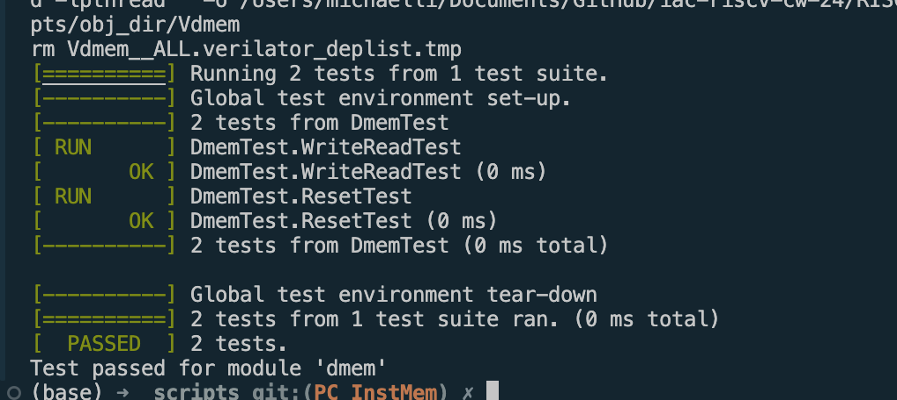
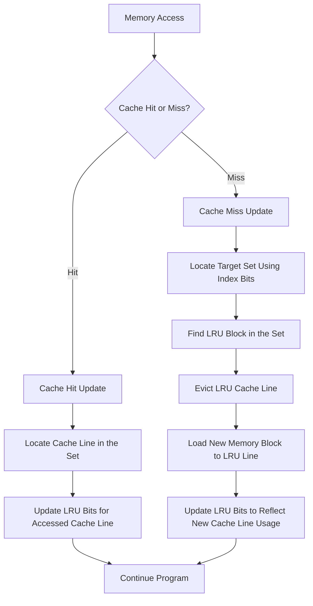
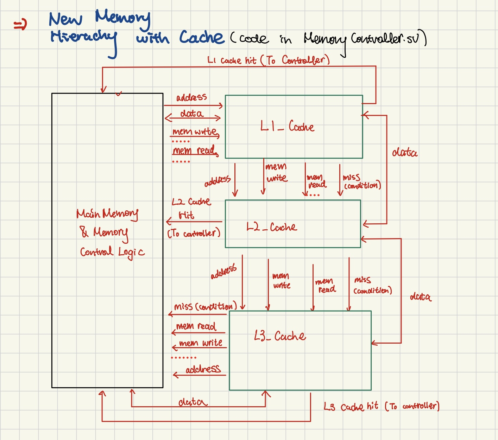
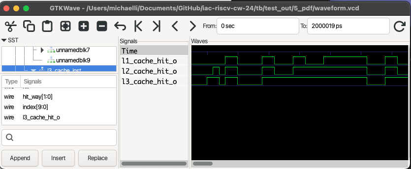
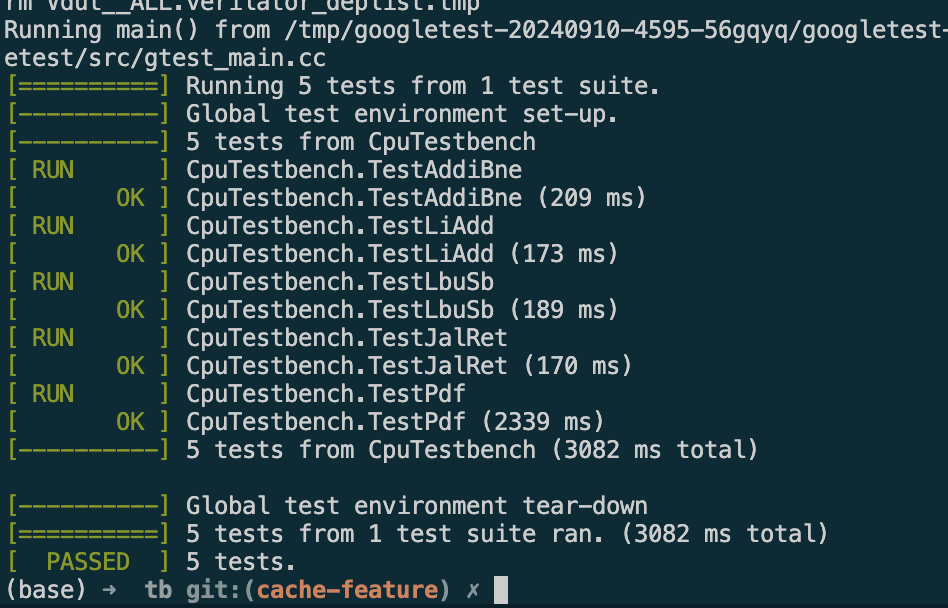
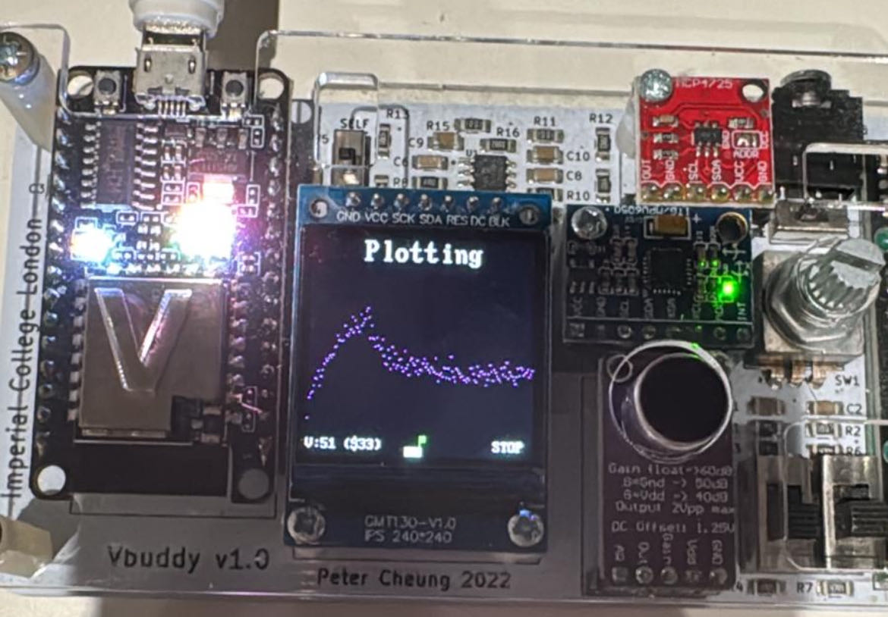
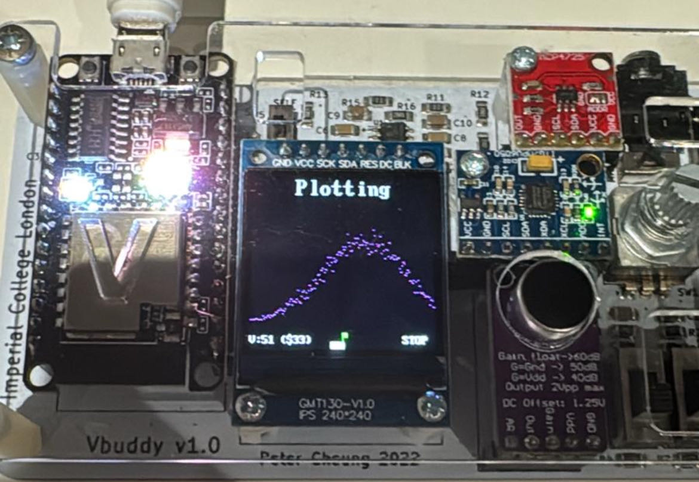

# Personal Statement for RISC-V RV32I Processor Coursework

### Statement Overview

- [Personal Statement for RISC-V RV32I Processor Coursework](#personal-statement-for-risc-v-rv32i-processor-coursework)
    - [Statement Overview](#statement-overview)
  - [1. CPU Design and Implementation: A Personal Journey](#1-cpu-design-and-implementation-a-personal-journey)
    - [1.1 Initial Group Work Allocation](#11-initial-group-work-allocation)
    - [1.2 Single Cycle Component Work](#12-single-cycle-component-work)
    - [1.3 Testing and Validation](#13-testing-and-validation)
  - [2. Cache System Design and Implementation Analysis](#2-cache-system-design-and-implementation-analysis)
    - [2.1 Core Cache Architecture](#21-core-cache-architecture)
      - [Cache Line Structure](#cache-line-structure)
    - [2.2 Cache Array Organization](#22-cache-array-organization)
    - [2.3 Address Decomposition Algorithm](#23-address-decomposition-algorithm)
      - [Address Fields](#address-fields)
    - [2.4 Hit Detection Logic](#24-hit-detection-logic)
  - [3. Cache Controller State Machine](#3-cache-controller-state-machine)
    - [Detailed Analysis](#detailed-analysis)
    - [3.1 State Definitions](#31-state-definitions)
    - [3.2 State Details](#32-state-details)
      - [IDLE State](#idle-state)
      - [WRITE\_BACK State](#write_back-state)
      - [READ\_MISS State](#read_miss-state)
      - [WRITE\_MISS State](#write_miss-state)
      - [UPDATE State](#update-state)
  - [4. LRU Implementation Details](#4-lru-implementation-details)
    - [4.1 LRU Bit Structure](#41-lru-bit-structure)
    - [4.2 LRU Update Logic Diagram](#42-lru-update-logic-diagram)
    - [4.3 LRU Decision Process](#43-lru-decision-process)
    - [4.4 LRU Implementation Analysis](#44-lru-implementation-analysis)
  - [5. Memory Controller Design](#5-memory-controller-design)
    - [5.1 Controller Interface](#51-controller-interface)
    - [5.2 Cache Level Interconnection](#52-cache-level-interconnection)
    - [5.3 L1/L2/L3 Cache IO](#53-l1l2l3-cache-io)
    - [5.4 Modify Hazard Unit to Control Stall Signals](#54-modify-hazard-unit-to-control-stall-signals)
    - [5.5 Result \& Analysis](#55-result--analysis)
    - [5.6 Optimization and Future Directions](#56-optimization-and-future-directions)
  - [6. Full Instruction CPU \& Assembly Debug](#6-full-instruction-cpu--assembly-debug)
    - [6.1 Instrution Implementation](#61-instrution-implementation)
    - [6.2 Fixing Minor Bugs of Offsert Waveform for Vbuddy PDF Program](#62-fixing-minor-bugs-of-offsert-waveform-for-vbuddy-pdf-program)
    - [6.3 Future Direction \& Optimization](#63-future-direction--optimization)
  - [7. Reflections and Learnings](#7-reflections-and-learnings)
    - [7.1 Deep Dive into Cache Design](#71-deep-dive-into-cache-design)
    - [7.2 Team Collaboration and Git Management](#72-team-collaboration-and-git-management)
    - [7.3 Testbench Development](#73-testbench-development)
  - [Acknowledgement \& Conclusion](#acknowledgement--conclusion)


## 1. CPU Design and Implementation: A Personal Journey

### 1.1 Initial Group Work Allocation

The first week was dedicated to understanding the fundamentals of a full-cycle single CPU. This period was marked by intense study and hands-on exploration, Our group started allocation of work distribution, which I have been assigned with the following parts: 
1. Single-Cycle CPU
    - Controller Units
    - Instruction Memory
    - Unit Testing
2. Cache: Two-Way Set Associate & Integration
3. Full RISCV CPU Implementation

### 1.2 Single Cycle Component Work

As the start of the project, I began to develop individual components of the CPU, each in its own SystemVerilog file with Unit Testing and Testbenches for further development before integration. This modular approach allowed for a systematic and organized development process. Here's a detailed breakdown of the components I worked with:

1. **Controller.sv**: The controller module managed the overall operation of the CPU, coordinating between different components to ensure smooth execution of instructions, since I have developed this part in the Lab 4. I modified the control units to implement more instructions. While our group used a simplified version for Pipelining, I developed this Controller which was used later in Stretched Goal.

- To decode RISC-V instructions and generate control signals for components like the ALU, register file, memory, and PC, I designed and implemented a RISC-V controller module in SystemVerilog. Below is a breakdown of the design process and key implementation details:

Key Instruction Mapping Example
| **Instruction Type** | **Key Signals**                                    | **Logic Implemented**                                             |
|-----------------------|---------------------------------------------------|--------------------------------------------------------------------|
| **R-Type**            | `rf_wen_o = 1`, ALU operation via `funct3_i`/`funct7_i` | Configures ALU for register-based operations like ADD, AND, etc.  |
| **I-Type**            | `alu_src2_sel_o = 01`, `imm_type_o = IMM_I`       | Handles immediate values for ALU operations (e.g., ADDI, ORI).    |
| **Load**              | `rf_wen_o = 1`, `rf_wdata_sel_o = 01`             | Reads from memory and writes to a register.                       |
| **Store**             | `mem_wen_o = 1`, `imm_type_o = IMM_S`             | Writes data from a register to memory.                            |
| **Branch**            | `next_pc_sel_o` set via branch condition signals  | Updates PC based on conditions like BEQ or BLT.                   |
| **Jump (JAL/JALR)**   | `rf_wdata_sel_o = 10`, `next_pc_sel_o = 10/11`    | Saves return address and jumps to target.                         |

- and I have also implemnted all the different cases in the module using a case scenario.[Link]

- To verify that this works, I improved the testbench files I used for Lab4, adding new testing logics for Branch and Load type instructions, with also illegal instructions to verify the workability of this submodule:

- **Controller Unit Testbench**


2. **Instruction Memory (imem.sv)**: These modules simulated the memory components of a real CPU, allowing for the storage and retrieval of data and instructions.

- The Instruction Memory (IMEM) module is responsible for storing and providing instructions to the processor. It is implemented as a byte-addressable memory array and supports reading 32-bit instructions. 
  


- **Instruction Fetching**
	•	Addressing Scheme: The input **addr_i** specifies the address of the instruction to fetch. Since RISC-V instructions are 32 bits (4 bytes) wide, the **addr_i** is divided:
	•	**addr_i[11:2]**: Determines the base address of the instruction in word-aligned format.
	•	**2'b00, 2'b01, 2'b10, 2'b11**: Specify which byte of the word to fetch.
	•	Combining Bytes: The always_ff block combines four consecutive bytes from the memory array to form a 32-bit instruction:
 ```systemverilog
	•	mem[{addr_i[11:2], 2'b11}]: Most significant byte (MSB).
	•	mem[{addr_i[11:2], 2'b10}]: Second byte.
	•	mem[{addr_i[11:2], 2'b01}]: Third byte.
	•	mem[{addr_i[11:2], 2'b00}]: Least significant byte (LSB).
 ```
 Therefore, to design the imem.sv module, I began by carefully analyzing the requirements for instruction fetching in a RISC-V architecture, particularly focusing on word-aligned access to 32-bit instructions. The first step was to define a memory array to simulate the instruction storage, ensuring each entry could hold 8-bit values to represent individual bytes. Next, I devised a scheme to handle addressing, leveraging the **addr_i** signal to index the memory. Specifically, the upper bits **addr_i[11:2]** were used to identify the base address of the word-aligned instruction, while the lower two bits specified the specific byte within the word. The key challenge was combining these bytes into a cohesive 32-bit instruction, which I achieved using an always_ff block to concatenate the four bytes from the memory array in the correct order—starting with the most significant byte (MSB) at **mem[{addr_i[11:2], 2'b11}]** and ending with the least significant byte (LSB) at **mem[{addr_i[11:2], 2'b00}]**. Finally, I validated the design through simulation, ensuring accurate fetching of instructions under various addressing scenarios and verifying the correct behavior of the memory alignment and byte combination logic. 
- To verify this works and my groupmate could use it in the later stage when integration, I also made unit testbench with it with test functions of: 
  - Sequential Read
  - Unaligned Read
  - Boundary Conditions
- InstructionMemory Testbench


### 1.3 Testing and Validation

To ensure the correctness and reliability of the designs, I meticulously wrote unit test benches for the majority of the components in the design. This was achieved by creating a modular_tb.sv file to simulate the input signals and behavior of the submodules and a corresponding modular_tb.cpp file to design Google Test functions. These test benches simulated various scenarios and edge cases, enabling me to identify and rectify issues before integrating the components into the design. The testing and validation process was iterative, with each iteration bringing us closer to a fully functional and efficient CPU.

- Register File Test: Reset & ReadWrite & ZeroRegisterBehavior

- Branch Test: Test all Branch Instructions

- Data Memory Test: ReadWrite & Reset

- PC Unit Test: Test all Jump Instructions

- ALU Test: Test all ALU Instructions


[Most Relevant Commit for Section 1]("https://github.com/opnuub/iac-riscv-cw-16/commit/a3f3f0584d648cb6eb74a3197592a65f355354bd")
## 2. Cache System Design and Implementation Analysis

### 2.1 Core Cache Architecture
####  Cache Line Structure
Since one of the stretched goals was to specifically designa a two way set associate cache, so we have started to design the first cache based on this structure. :

```systemverilog
typedef struct packed {
    logic valid;           // Valid bit
    logic dirty;           // Dirty bit for write-back
    logic [TAG_WIDTH-1:0] tag;  // Tag bits
    logic [DATA_WIDTH-1:0] data; // Actual data
} line_t;
```

This structure is the fundamental building block for each cache line. The tag width is dynamically calculated based on the set width:
```systemverilog
parameter TAG_WIDTH = DATA_WIDTH - SET_WIDTH - 2
```

### 2.2 Cache Array Organization
```systemverilog
line_t cache[2**SET_WIDTH][2];  // Two-way set associative
logic [2**SET_WIDTH-1:0] lru;   // LRU bits for each set
```

The cache is organized as a 2D array where:
- First dimension: Number of sets (2^SET_WIDTH)
- Second dimension: Two ways (fixed for two-way set associative)

### 2.3 Address Decomposition Algorithm

#### Address Fields
```systemverilog
logic [TAG_WIDTH-1:0] tag;
logic [SET_WIDTH-1:0] index;
logic way;
logic hit_way;

assign tag = address[DATA_WIDTH-1:SET_WIDTH+2];
assign index = address[SET_WIDTH+1:2];
```

### 2.4 Hit Detection Logic
```systemverilog
always_comb begin
    hit = 0;
    hit_way = 0;

    if (cache[index][0].valid && cache[index][0].tag == tag) begin
        hit = 1;
        hit_way = 0;
    end else if (cache[index][1].valid && cache[index][1].tag == tag) begin
        hit = 1;
        hit_way = 1;
    end

    way = lru[index];
    if (!cache[index][0].valid) way = 0;
    else if (!cache[index][1].valid) way = 1;
end
```

1.	Cache Hit Detection:
•	**Initializes** hit (indicating a cache hit) and hit_way (indicating the cache way that hit) to 0.
•	**Checks** the validity (valid) and tag match of each cache line (**cache[index][0]** and **cache[index][1]**):
•	If **cache[index][0]** is **valid** and its tag matches the input tag, it sets hit = 1 and hit_way = 0.
•	If **cache[index][1]** is **valid** and its tag matches, it sets hit = 1 and hit_way = 1.
2.	Replacement Way Selection:
•	Uses the Least Recently Used (LRU) mechanism **(lru[index])** to select the replacement way by default.
•	Overrides the LRU decision:
•	If **cache[index][0]** is invalid, selects way 0 (way = 0).
•	If **cache[index][1]** is invalid, selects way 1 (way = 1).

Below is the most relevant commit that cache passed the basic unit test for write back: [Cache1 Unit Test Passed Commit]("https://github.com/opnuub/iac-riscv-cw-16/commit/943ff76ef60498c74b3a94936426ca2ead0c6639#diff-30ba30756adb35a1ecbf4b3b22e1cd36e622bc47a4c31fed0eb373679c20f129")
## 3. Cache Controller State Machine

### Detailed Analysis

To provide a detailed analysis of the cache design, I created a hierarchy diagram that illustrated the structure and interactions of the various components involved. The reason I chose to implement a state because it provides a structured and efficient way to manage the cache’s complex operations, such as tag matching, data retrieval, and replacement policies. By clearly defining states for operations state machine ensures that the cache controller handles requests systematically, avoiding ambiguity and conflicts. This approach makes it easier to incorporate features like hit/miss detection and least-recently-used (LRU) replacement logic, as each step in the process can be assigned to a specific state with well-defined transitions. Additionally, using a state machine simplifies debugging and verification, as the predictable flow of execution ensures that edge cases are handled consistently. 

This diagram served as a visual aid, helping me and my team understand the flow of data and control within the cache system.

### 3.1 State Definitions
```verilog
typedef enum logic [2:0] {
    IDLE,
    READ_MISS,
    WRITE_MISS,
    WRITE_BACK,
    UPDATE
} state_t;
```


### 3.2 State Details

#### IDLE State
```systemverilog
IDLE: begin
    if (miss) begin
        busy <= 1;
        if (cache[index][way].valid && cache[index][way].dirty) begin
            mem_write <= 1;
            state <= WRITE_BACK;
        end else if (load) begin
            mem_read <= 1;
            state <= READ_MISS;
        end else begin
            state <= WRITE_MISS;
        end
    end else begin
        busy <= 0;
        mem_write <= 0;
        mem_read <= 0;
        if (hit && store) begin
            cache[index][hit_way].data <= data_in;
            cache[index][hit_way].dirty <= 1;
            lru[index] <= !hit_way;
        end else if (store) begin
            cache[index][way].dirty <= 1;
        end
    end
end
```

Key Operations:
1. Hit detection
2. Miss handling initiation
3. LRU update on hits
4. Dirty bit management

#### WRITE_BACK State
```systemverilog
WRITE_BACK: begin
    if (mem_ready) begin
        mem_write <= 0;
        mem_read <= load;
        state <= load ? READ_MISS : WRITE_MISS;
    end
end
```

Key Operations:
1. Write dirty data to memory
2. Wait for memory acknowledgment
3. Transition based on original operation

#### READ_MISS State
```systemverilog
READ_MISS: begin
    if (mem_ready) begin
        mem_read <= 0;
        state <= UPDATE;
    end
end
```

Key Operations:
1. Wait for memory read completion
2. Prepare for cache update

#### WRITE_MISS State
```systemverilog
WRITE_MISS: begin
    state <= UPDATE;
end
```

Key Operations:
1. Direct transition to update
2. No memory wait required

#### UPDATE State
```systemverilog
UPDATE: begin
    busy <= 0;
    cache[index][way].valid <= 1;
    cache[index][way].dirty <= store;
    cache[index][way].tag <= tag;
    cache[index][way].data <= store ? data_in : mem_data;
    lru[index] <= !way;
    state <= IDLE;
end
```

Key Operations:
1. Update cache line
2. Set validity and dirty bits
3. Update LRU
4. Return to IDLE

## 4. LRU Implementation Details

### 4.1 LRU Bit Structure
```systemverilog
logic [2**SET_WIDTH-1:0] lru;  // One bit per set
```

### 4.2 LRU Update Logic Diagram




### 4.3 LRU Decision Process

1. **On Cache Hit:**
```systemverilog
if (hit && store) begin
    cache[index][hit_way].data <= data_in;
    cache[index][hit_way].dirty <= 1;
    lru[index] <= !hit_way;  // Mark other way as LRU
end
```

2. **On Cache Miss:**
```systemverilog
way = lru[index];  // Select LRU way for replacement
if (!cache[index][0].valid) way = 0;
else if (!cache[index][1].valid) way = 1;
```

3. **After Replacement:**
```systemverilog
lru[index] <= !way;  // Mark current way as most recently used
```

### 4.4 LRU Implementation Analysis

The LRU implementation uses a single bit per set where:
- `lru[index] = 0`: Way 1 is least recently used
- `lru[index] = 1`: Way 0 is least recently used

Benefits and reason for this implementation:
1. Minimal hardware overhead (single bit per set)
2. Simple update logic
3. Fast LRU determination
4. Efficient and easy way selection compare to other methods

[Most Relevant Commit for Cache Development & Debug]("https://github.com/opnuub/iac-riscv-cw-16/commit/05ec666a3d472f2fac9f86d106d0537b7ae9fb47")

## 5. Memory Controller Design
The original memory hierachy design from pipeline looked like this with the processor:


To integrate the design with caches, I implemented based on the original DataMemory.sv, and Renamed it as MemoryController, with the following logic of how the interior design looks like:


In the new design, I linked L1 L2 and L3 Cache with mainmemory, and 

### 5.1 Controller Interface
```systemverilog
module MemoryController #(
    parameter DATA_WIDTH = 32,
    parameter ADDR_WIDTH = 17
) (
    input  logic                   clk,
    input  logic                   rst_n,
    input  logic                   MemWrite,
    input  logic [2:0]            SizeCtr,
    input  logic [ADDR_WIDTH-1:0] addr,
    input  logic [DATA_WIDTH-1:0] WriteData,
    output logic [DATA_WIDTH-1:0] ReadData,
    output logic                  MemReady
);
```

### 5.2 Cache Level Interconnection
The memory controller manages the interconnection between cache levels through internal signals:

```systemverilog
// L1 Cache signals
logic l1_hit, l1_miss, l1_mem_write, l1_mem_read, l1_busy;
logic [DATA_WIDTH-1:0] l1_data_out, l1_mem_write_data;

// L2 Cache signals
logic l2_hit, l2_miss, l2_mem_write, l2_mem_read, l2_busy;
logic [DATA_WIDTH-1:0] l2_data_out, l2_mem_write_data;

// L3 Cache signals
logic l3_hit, l3_busy;
logic [DATA_WIDTH-1:0] l3_data_out;
```

### 5.3 L1/L2/L3 Cache IO

The three levels of cache—L1, L2, and L3—share a similar design in terms of inputs and outputs, with the main difference being their size, latency, and sometimes associativity. Each level takes the same inputs, including memory addresses, data, and control signals (e.g., read/write), and outputs retrieved data and status signals (e.g., hit/miss). The fundamental operations, such as checking for data, fetching on a hit, or forwarding a miss to the next level, remain consistent across all levels. However, L1 is smaller and faster, optimized for immediate CPU access, while L2 and L3 progressively increase in size and latency to handle larger data sets efficiently.

```systemverilog
L1Cache #(
    .DATA_WIDTH(DATA_WIDTH),
    .SET_WIDTH(5)
) l1_cache (
    .clk(clk),
    .rst_n(rst_n),
    .load(!MemWrite && mem_access),
    .store(MemWrite && mem_access),
    .address({15'b0, addr}),
    .data_in(WriteData),
    .mem_data(l2_data_out),
    .mem_ready(!l2_busy),
    // Other connections
);
```

The provided code snippet demonstrates how the three levels of cache (L1, L2, and L3) interact to retrieve data in a hierarchical caching system. The logic prioritizes the lowest-level cache with a hit: if the data is in L1 **(l1_hit)**, it is retrieved from l1_data_out, and the system signals readiness **(MemReady = 1)**. If L1 misses, the system checks L2 **(l2_hit)**, and similarly, if L2 misses, it checks L3 **(l3_hit)**. If all cache levels miss, the data is retrieved from main memory **(main_mem_data)**, with MemReady only signaling readiness when the main memory is prepared, and none of the caches are busy **(!l1_busy, !l2_busy, !l3_busy)**. This logic ensures efficient data retrieval by prioritizing faster, smaller caches and falling back to main memory as a last resort.

```systemverilog
always_comb begin
    if (l1_hit) begin
        ReadData = l1_data_out;
        MemReady = 1;
    end else if (l2_hit) begin
        ReadData = l2_data_out;
        MemReady = 1;
    end else if (l3_hit) begin
        ReadData = l3_data_out;
        MemReady = 1;
    end else begin
        ReadData = main_mem_data;
        MemReady = main_mem_ready_reg && !l1_busy && !l2_busy && !l3_busy;
    end
end
```


The above wave trace from the program showed this logic, where the three level of caches hits data and update sequentially to ensure that data consistency, and in chronologically order, which is maintained across all cache levels while minimizing latency.

### 5.4 Modify Hazard Unit to Control Stall Signals

To implement the stall logic in the Hazard Unit, I first identified scenarios that require stalling, including load-use hazards, control hazards (branching or jumps), and memory stalls. I investigated into the combinational logic block to evaluate these conditions based on pipeline register dependencies and control signals. Specifically, for load-use hazards, I checked if the destination register in the Execute stage matched the source registers in the Decode stage when a memory read operation was active. For control hazards, I remodified and incorporated signals indicating branches and jumps, and also added debug signals for viewing the logic of flush and stall units comparing with Cache States.

[Most Relevant Commit]("https://github.com/opnuub/iac-riscv-cw-16/commit/395d0e2fbb8a7543e3710e644db533c618e79a74")

However, realizing that the Hazard Unit operates as part of a state machine simplifies the stall logic, as the state machine inherently ensures sequential processing and coordination across pipeline stages. Unlike a more complex multi-threaded or out-of-order execution pipeline, a state machine processes one instruction at a time within a defined sequence of states. This characteristic reduces the need for multiple independent stall units, as the state transitions naturally enforce dependencies and resolve hazards within a single unified structure. Consequently, the stall logic only needs to address key scenarios like load-use hazards, control hazards, and memory stalls, as these are the main disruptions to the otherwise orderly flow.

```systemverilog

    if (load_use_hazard) begin 
        stall = 1'b1;   
        FlushE = 1'b1;  
        FlushD = 1'b0;  
    end else if (control_hazard) begin
        stall = 1'b0;   
        FlushD = 1'b1;  
        FlushE = 1'b1;  
    end else if (mem_stall) begin
        stall = 1'b1;   
        FlushE = 1'b1;   
        FlushD = 1'b0; 
    end else begin
        stall = 1'b0;  
        FlushD = 1'b0;
        FlushE = 1'b0;
    end
```

The final version of the Hazard Unit reflects this streamlined approach. By consolidating stall conditions into a central logic block and integrating forwarding and flushing mechanisms within the same framework, the design minimizes complexity while maintaining functionality. This efficiency ensures that the Hazard Unit handles all critical pipeline hazards without the need for redundant or overly granular control signals, making it a compact yet robust solution for managing dependencies and maintaining data consistency in a state-machine-driven pipeline.


### 5.5 Result & Analysis



### 5.6 Optimization and Future Directions

Reflecting on the cache design process, I recognize that there are several areas where further optimization is possible. For instance, exploring different replacement algorithms could enhance the cache's efficiency and reduce latency. Additionally, incorporating prefetching mechanisms could further improve the system's performance by anticipating and fetching data before it is needed.

## 6. Full Instruction CPU & Assembly Debug

### 6.1 Instrution Implementation
After finishing the major branches. We have found out we are only missing a few instructions from completing a Full instruction CPU based on the stretched goals. The missing instructions were: 
- **R-type: SRA (Arithmetic right shift), SRAI**
  
```
 4'b1000: aluResult = signedA >>> shiftAmt;
```

- **I-type: SRAI (Arithmetic right shift immediate), SLTIU (Set less than immediate unsigned)**
- **U-type: AUIPC (Add upper immediate to PC)**

```
// Special operations (LUI/AUIPC)
2'b11: begin
    if (op)
        aluControl = 4'b0100; // lui
    else
        aluControl = 4'b1011; // auipc
end
```

Therefore, I added these instructions **inside the pipieline branch** and modified the ALU & ALU Decoder to implement these logic. After that, I also wrote a several base case test assembly code to validate these instructions, while also designing a stress test to test the boundaries of some of the newly developed code. Here are the details of the assembly code that is implemented (since assembly code 6 is f1_light, I will introduce the new written assembly code one by one starting from asm 7):

1. Bitwise operation testing (with xor, we didn't implement before)
2. All Shift operation testing
3. All Comparison operation testing
4.  Memory operation testing
5.  Branch instruction testing
6.  Upper immediate instruction testing
7.  Data hazard handling testing
8.  Overflow and edge case testing
9.  Jump and branch instruction testing
10. Logical and all arithmetic shift testing (new)
11. All newly implemented instruction testing
12. AUIPC instruction offset testing (new)

 Specific assembly code can be found in the Full_Instruction code, under [/tb/asm folder]("") directory
 
 
[Most Relevant Commit]("https://github.com/opnuub/iac-riscv-cw-16/commit/9c4ca525f978f2b64da3972eea36939d514af38f#diff-05d63b49c48622028b72200bd9b4330d51d90a6497b585845d160e85339584beR15")

### 6.2 Fixing Minor Bugs of Offsert Waveform for Vbuddy PDF Program

In the end of the day when we are validating the last pdf program for the CPU, the pdf program was offset by a few and we all couldn't find the issue. The offset wrong pdf program looked like these two pictures:




In the end, I reviewed the top testbench program in the PDF and identified an issue with the frequency settings. To address this, I modified the loop as follows:

```C
if (int(top->a0) == -1){
            startDisplaying = true;
            discyc = simcyc+3;
        }

        if (startDisplaying and simcyc == discyc and norm_dist.size()<240){
            norm_dist.push_back(int(top->a0));
            discyc += 3;
        }
```

This adjustment ensures that the frequency is updated appropriately to display all the data. Additionally, I revised some of the conditions related to this frequency change in other files to maintain consistency and proper functionality, and now the output PDF looked like this:


[Most Related Commit]("https://github.com/opnuub/iac-riscv-cw-16/commit/609d835db64f4ef7c3fb81d101816114f8a4c5a2#diff-abfd7fa5ab6c006971361e0cd7e7a787119ad0c068e0fb3c49c6ddb2a9fa41abR48")

### 6.3 Future Direction & Optimization
The full CPU and assembly code was a stretch goal we attempted at the final stages of the project (Stretched Goal 3). We managed to complete most of the implementation and thoroughly tested edge cases and extreme scenarios while ensuring that all instructions were validated. Upon reflection, if we had more time, we would have designed and tested more complex, full-scale programs to provide a more comprehensive evaluation of the CPU. I also look forward to exploring the remaining instructions not included in the stretch goals after submitting the project and identifying additional issues to debug. After spending so much time debugging, testing, and modifying this CPU, I have developed a profound understanding of every part of the CPU, each submodule, and every signal. As a result, integrating these new instructions was not particularly challenging but rather an enriching experience that solidified my grasp of the CPU’s overall design.

## 7. Reflections and Learnings

### 7.1 Deep Dive into Cache Design

The process of designing the cache was both challenging and enlightening. Initially, my understanding of caches was limited to their role as a bridge between data memory and the CPU. However, through this project, I gained a profound appreciation for the intricacies of cache design and its impact on system performance. I learned about various caching strategies, such as direct-mapped, set-associative, and fully associative caches, each with its own trade-offs in terms of complexity, cost, and performance.

Moreover, I delved into advanced topics such as cache coherence and consistency, which are crucial for multi-core systems. Understanding these concepts has sparked my interest in more advanced memory systems, including virtual memory and memory management units (MMUs).

### 7.2 Team Collaboration and Git Management

This project marked my first experience using Git for collaborative software development. The ability to track changes, manage branches, and merge code was invaluable, especially given the complexity and scale of our project. Through Git, I could monitor my teammates' progress, provide feedback, and contribute to the project in a structured and efficient manner.

Learning to navigate the Git workflow and resolve merge conflicts has significantly enhanced my software development skills. It has also taught me the importance of clear communication and coordination in team projects.

### 7.3 Testbench Development

Developing comprehensive testbenches was an essential part of ensuring the correctness and reliability of our designs. I devoted significant effort to writing and refining testbenches for each component, meticulously simulating a wide range of scenarios to identify potential edge cases and subtle issues. Through this process, I gained a deeper appreciation for the critical role thorough testing and validation play in the development lifecycle, particularly in hardware design, where small errors can cascade into system-wide failures.

This experience also emphasized the importance of understanding how individual submodules function and interact within the larger system. In a complex project like CPU design, where signals, control I/O, and hierarchical architecture create a high level of interdependence, having a clear grasp of each submodule’s behavior is vital. It taught me that success in such intricate designs hinges on balancing attention to detail at the module level with a comprehensive understanding of the overall system, ensuring all components work seamlessly together, saving more time and effort for the other collaboraters.

## Acknowledgement & Conclusion

In the end,  I would like to express my deepest gratitude to my teammates, whose dedication and countless hours spent in the library made this project possible. This project would not have had such a strong start without Cole, who took the initiative to integrate and debug the first single-cycle CPU early on, laying the most crucial foundation for our advanced followup development. A heartfelt thanks to Flavio, with whom I spent the final days in the library, meticulously going through the code line by line and analyzing wave traces to debug our pipeline and cache versions. My sincere appreciation also goes to Soon Yung, the unsung hero working tirelessly behind the scenes, ensuring seamless integration between the software and hardware components. His efforts in testing every part of the program on the Vbuddy and resolving issues in the lower-level assembly code were instrumental to our success. Lastly, I extend my gratitude to Professor Cheung and the teaching assistants for their engaging lectures and unwavering support during problem classes, introducing us to the fascinating world of FPGAs and the intricacies of computer architecture.

Overall, the RISC-V RV32I Processor Coursework has been an invaluable learning experience, providing me with a deep understanding of CPU design, cache mechanisms, and collaborative software development. Through this project, I have not only honed my technical skills but also gained valuable insights into the complexities of system design and optimization. Looking ahead, I am eager to apply these learnings to more advanced projects and further explore the fascinating world of computer architecture and memory systems.
