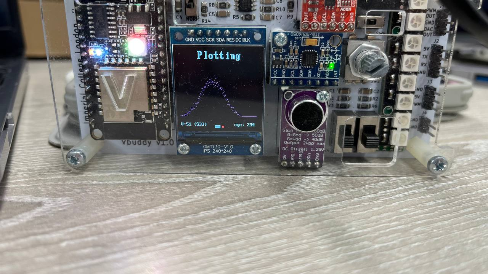
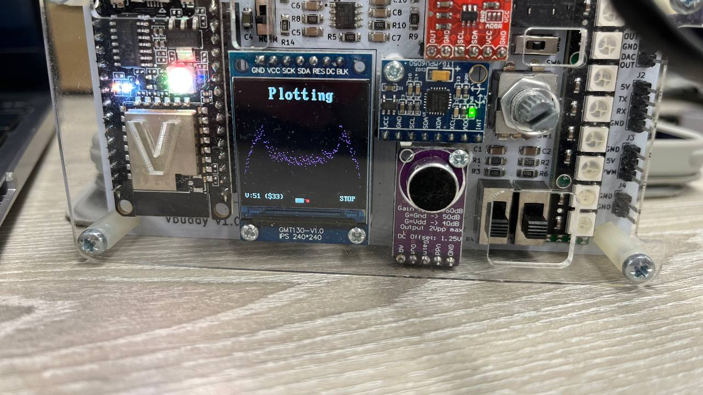
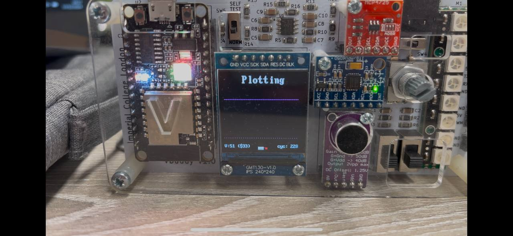

# Instruction Architecture RISC-V Coursework - Group 16

## Overview

Streched goals are in the following locations:


| Branch   | Descripton                |
| -------- | ------------------------- |
| [Branch] | Lab 4 - Simplified RISC-V |
| [Branch](https://github.com/opnuub/iac-riscv-cw-16/tree/Full_Instruction) | Basic  RISC-V CPU         |
| [Branch](https://github.com/opnuub/iac-riscv-cw-16/tree/pipeline) | Pipelined RV32I Design    |
| [Branch](https://github.com/opnuub/iac-riscv-cw-16/tree/Cache) | Data Memory Cache         |

## Personal Statements


| Member    | Personal Statement                                                                                                            |
| --------- | ----------------------------------------------------------------------------------------------------------------------------- |
| Cole      | [Peronal Statement](Github.com)                                                                                               |
| Flavio    | [Peronal Statement](Flavio_Gazzetta_Project_Brief.md)                                                                                               |
| Michael   | [Peronal Statement](Michael_Statement.md)                                                                                               |
| Soon Yung | [Peronal Statement](https://github.com/opnuub/iac-riscv-cw-16/blob/main/Logbooks/Personal%20Statements/SoonYung_Statement.md) |

## Navigation

### Layout

We've divided our different versions of the CPU into 4 branches:</br>
`main`: For Single-Cycle & For Pipeline & For Cache & For Full_Instruction</br>
`Pipeline`: For pipeline </br>
`Cache`: For two-set cache associative </br>
`Full_Instruction`: For full instruction </br>

### Directory Navigation

In all three files they share the same basic layout:</br>
`rtl`: All `.sv` files</br>
`tb`: All testbench related files.

## Quickstart

### Verify.cpp

To test for verify.cpp, please traverse to the `tb` folder and enter the following:

```
./doit.sh
```

### F1 Lights

Once within the `tb` folder, run `./attach_usb` to connect to the Vbuddy, then traverse to the `f1_program` folder and run `./doit.sh` after giving it full permission. This can be done using `sudo chmod 777 doit.sh`. The knob on the Vbuddy switches the reset flag high and low. To start the program, ensure that the reset is set low. Once the program ends and you intend to start the F1 program again, switch the flag high then low.

> Note: We note that the time taken and result shown by this command may differ depending on the layout and or previous commands you gave. To ensure it runs correctly, it is advised to run the doit.sh file several times.

### PDF Plotting

Once within the `tb` folder, run `./attach_usb` to connect to the Vbuddy, then traverse to the `pdf_program` folder and run `./doit.sh <file.mem>` after giving it full permission. `file.mem` is a data file in `/tb/reference`, so if we are loading `/tb/reference/gaussian.mem`, the command should be `./doit.sh gaussian.mem`. 

## Working Evidence (PDF Plotting)


| Dataset  | Graph                                                                      | Video                                                             |
| -------- | -------------------------------------------------------------------------- | ----------------------------------------------------------------- |
| Gaussian |  | [Gaussian Plot Video](https://www.youtube.com/shorts/S-n3LoTKLPA) |
| Noisy    |        | [Noisy Plot Video](https://youtube.com/shorts/oGnb0cSuTNY)        |
| Triangle |  | [Triangle Plot Video](https://youtu.be/bxq5VPnM24I)               |

## Working Evidence (F1 Lights)

[F1 Video](https://youtube.com/shorts/eye_c77uzMk)

## Contributions

### Task Allocation

The team allocated tasks based on the following factors:

1. Competency - We ensured that more capable members would handle tasks that suited individual work (E.g pipeline stretched goal)
2. Significance - We spread out tasks to ensure that everyone in the group contributed a significant portion to the project
3. Interest - Members were allowed to choose certain tasks if they were interested in doing it.

### Single Cycle Processor


| Module                 | File Names                                                       | Flavio (@FlavioGazzetta) | Cole (@opnuub) | Michael (@Happymic) | Soon (@so0nyung) |
| ---------------------- | ---------------------------------------------------------------- | ------------------------ | -------------- | ------------------- | ---------------- |
| Program Counter        | `pcReg.sv`, `top.sv`, `pcMux.sv`                                 | F                        | P              |                     |                  |
| ALU & RegisterFile     | `alu.sv`, `aluMux.sv`, `regFile.sv`                              | F                        | P              |                     |                  |
| Instruction Processing | `instrMemory.sv`, `extend.sv`, `controlUnit.sv`, `branchUnit.sv` |                          | F              | P                   |                  |
| Full Integration       | `top.sv`                                                         |                          | F              |                     |                  |
| Data Memory            | `dataMemory.sv`                                                  | F                        | P              |                     |                  |
| F1 Program             | f1.s                                                             |                          | P              |                     | F                |
|                        | f1.sv                                                            |                          | P              |                     | F                |
|                        | f1_tb.cpp                                                        |                          |                |                     | F                |
|                        | lfsr.sv                                                          |                          |                |                     | F                |
| PDF Plotting           | pdf_tb.cpp                                                       |                          |                |                     | F                |
|                        | doit.sh                                                          |                          | P              |                     | P                |
| Unit Testing           | Multiple assembly files                                          |                          |                | P                   | F                |


&nbsp;

| Module                 | File Names                                                       | Flavio (@FlavioGazzetta) | Cole (@opnuub) | Michael (@Happymic) | Soon (@so0nyung) |
| ---------------------- | ---------------------------------------------------------------- | ------------------------ | -------------- | ------------------- | ---------------- |
| Full instruction set   |                                                                  |                          |                |          M          |                  |


&nbsp;

### Pipelined Processor


| Part                       | File                                                                    | Flavio (@FlavioGazzetta) | Cole (@opnuub) | Michael (@Happymic) | Soon (@so0nyung) |
| :------------------------- | :---------------------------------------------------------------------- | :----------------------: | :------------: | :-----------------: | :--------------: |
| Pipeline Registers         | PRegFetch.sv, PRegDecode.sv, PRegExecute.sv, PRegMemory.sv              |            F            |                |                    |                  |
| Jump Control               | JalrMux.sv                                                              |            F            |                |                    |                  |
| Module Signal Reconnection | alu.sv, controlUnit.sv, extendPC.sv, resultMux.sv                       |            F            |                |                    |                  |
| Reformat Intermediate TOPs | FetchTOP.sv, DecodeTOP.sv, ExecuteTOP.sv, MemoryTOP.sv, WritebackTOP.sv |            F            |                |                    |                  |
| Hazard Handling            | HazardUnit.sv                                                           |            F            |                |                    |                  |
|                            | HazardMux.sv                                                            |            F            |                |                    |                  |
| Full Integration           | top.sv                                                                  |            F            |                |                    |                  |

&nbsp;

### Set Associative Cache


| Part              | File                                 | Flavio (@FlavioGazzetta) | Cole (@opnuub) | Michael (@Happymic) | Soon (@so0nyung) |
| :---------------- | :----------------------------------- | :----------------------: | :------------: | :-----------------: | :--------------: |
| Two-way set cache | HazardUnit.sv (Cache - Memory stall) |            P            |                |          F          |                  |
|                   | MemoryControler.sv                   |                          |                |          F          |                  |
|                   | L1Cache.sv                           |                          |                |          F          |                  |
|                   | L2Cache.sv                           |                          |                |          F          |                  |
|                   | L3Cache.sv                           |                          |                |          F          |                  |

As a group, we do not believe that the commits may accurately reflect the given contributions. This is because we regularly sent individual files to each other (via Whatsapp, for example) or ran testbenches on a singular computer and push commits on another. As such, we believe that reading logbooks, personal statements and the team statement in conjuction with the commits.
