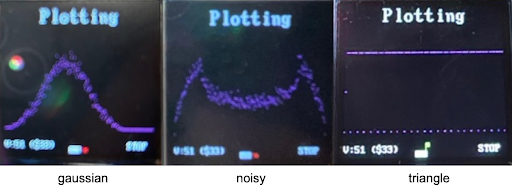

# Instruction Architecture RISC-V Coursework

### Shenghong Liu's Personal Statement

## Overview

* Control Unit
* Special Branch Unit
* Sign Extension Unit
* Instruction Memory
* Jump Instructions
* F1 Program
* Reference Program
* Additional Comments

## Control Unit [🔗](https://github.com/opnuub/iac-riscv-cw-16/blob/main/rtl/controlUnit.sv)

Relevant Commit: [integration completed](https://github.com/opnuub/iac-riscv-cw-16/commit/a3e03a67a19ab23d8b8f38258842154a80954539#diff-7160870a649dbbb4ce8e9fcb4bc291b7deeb7d0ed76f2e8d8d4e336321fbd798) for `mainDecoder.sv, aluDecoder.sv, controlUnit.sv`

I made the control unit for the single-cycle RV32I CPU, which consists of two modules: main decoder and arithmetic logic unit (ALU) decoder. The main decoder determines the type of the incoming instruction, sets various flags and outputs the 2-bit ``aluOp`` to ALU decoder. ``aluOp`` and other information from the 32-bits instruction will determine the 3-bit ``aluControl``, which acts as a selector for the ALU module.

### Main Decoder [🔗](https://github.com/opnuub/iac-riscv-cw-16/blob/main/rtl/mainDecoder.sv)

A case statement is used to set flags for each instruction type. Flags include:

* ``zero``: if branch condition is met
* ``pcSrc``: selector for pcMux
* ``jalrSrc``: changes immediate value if instruction is JALR
* ``jumpSrc``: selector for jumpMux
* ``resultSrc``: selector for resultMux
* ``memWrite``: enable signal for data memory module
* ``aluSrc``: selector for aluMux
* ``immSrc``: selector for sign extension unit
* ``regWrite``: enable signal for register file module
* ``aluOp``: selector for ALU decoder

### ALU Decoder [🔗](https://github.com/opnuub/iac-riscv-cw-16/blob/main/rtl/aluDecoder.sv)

A case statement is used to set ``aluControl`` for each ``aluOp`` type.


| aluOp |   instruction type   |
| :---: | :------------------: |
|  00  |     load, store     |
|  01  |        branch        |
|  10  |       register       |
|  11  | load upper immediate |

## Special Branch Unit [🔗](https://github.com/opnuub/iac-riscv-cw-16/blob/main/rtl/branchUnit.sv)

Relevant Commit: [integration completed](https://github.com/opnuub/iac-riscv-cw-16/commit/a3e03a67a19ab23d8b8f38258842154a80954539#diff-7160870a649dbbb4ce8e9fcb4bc291b7deeb7d0ed76f2e8d8d4e336321fbd798) for `branchUnit.sv`

To make the design cleaner, I created a seperate component to determine ``zero`` for branch instructions. Since the control unit is designed to let ``aluControl`` be ``funct3`` when it is a branch instruction, a case statement is used to determine whether or not to branch.

## Sign Extension Unit [🔗](https://github.com/opnuub/iac-riscv-cw-16/blob/main/rtl/extend.sv)

Relevant Commit: [partial integration of pc section](https://github.com/opnuub/iac-riscv-cw-16/commit/86374e749b150d96105d46942de1f1c13216babd#diff-1df4144bfe339934a01ccfa6935d25a42d7616d0643d10e2c7e13321e13ce8aa)

Since the sign extension unit in Lab 4 only takes in account two instruction types, I modified this unit for all necessary instructions. The selector ``immSrc`` is only 2-bit because ``lui``, ``jal`` and ``jalc`` all has the immediate values at ``instruction[31:12]``. Hence, these three instructions share the same ``immSrc`` value, but is differentiated by the ``jumpSrc`` flag, which is set high when it's a jump instruction.


| immSrc | instruction type |
| :----: | :--------------: |
|   00   |       addi       |
|   01   |      store      |
|   10   |      branch      |
|   11   |    lui, jump    |

## Instruction Memory [🔗](https://github.com/opnuub/iac-riscv-cw-16/blob/main/rtl/instrMemory.sv)

Relevant Commit: [update instruction memory](https://github.com/opnuub/Lab4/commit/3a8db7d166c1a1b4af9027c40976dd554a4146c6) (commit is in another repo because instrMemory was written in Lab4)

The instruction memory component is a ROM with 32-bit input (program counter address ranging from ``0xBFC00000`` to ``0xBFC00FFF``) and 32-bit output. Since program counter has a range of ``0xFFF`` which is 12 bits, ROM will have a size of 4096 bits.

`program.hex` is in byte-addressing format and in little-endian order. Therefore, to retrieve the instruction, the ROM is accessed using the least significant 12 bits of the program counter address, and in little-endian order.

`instr = {rom[pc[11:0] + 3], rom[pc[11:0] + 2], rom[pc[11:0] + 1], rom[pc[11:0]]};`

Likewise, for every cycle, program counter address increments by 4.

## Jump Instructions

Relevant Commit: [added jump instruction](https://github.com/opnuub/iac-riscv-cw-16/commit/25d7a8b7f1f8e71db2be494ea1576970e52bfd9f)

To implement ``jal`` and ``jalr``, two flags ``jumpSrc`` and ``jalrSrc``. ``jumpSrc`` is high when it's a jump instruction, and ``jalrSrc`` is high when it's a ``jalr`` instruction.

When its a jump instruction, `rd = PC + 4`. Therefore, I created multiplexer ``jumpMux`` with selector ``jumpSrc``. This multiplexer will pass ``PC + 4`` to the write port if ``jumpSrc`` is high.

For the ``jalr`` instruction, we need ``PC = rs1 + SignExt(imm)`` instead of ``PC = PC + SignExt(imm)`` for branch instructions. Hence, I created multiplexer ``extendPC`` with selector ``jalrSrc``. This multiplexer will choose `PC = rs1 + SignExt(imm)` instead of `PC = PC + SignExt(imm)` when `jalrSrc` is high.

<p align="center"> </p>

## F1 Program [🔗](https://github.com/opnuub/iac-riscv-cw-16/tree/main/tb/f1_program)

Relevant Commits: [Bugs resolved](https://github.com/opnuub/iac-riscv-cw-16/commit/b53f55ffd30afb0803a615c9ce6b187a25b1d904)   [F1 Program with bugs](https://github.com/opnuub/iac-riscv-cw-16/commit/cefd0cda42676254a68bebdc37e73ae2c5c0ae9d)

I created new files relevant to the F1 program under folder ``f1_program``:

```
f1_program
|    vbuddy.cfg
│    vbuddy.cpp
|    f1_asm.s
|    f1_tb.cpp
|    f1.sv
|    lfsr.sv
|    clktick.sv
|    fsm.sv
|    doit.sh
```

`f1.sv` contains the single-cycle RISC-V CPU `top.sv`, timer `clktick.sv` that produces one cycle every second, and a Linear Feedback Shift Register `lfsr.sv` that produces a pseudo-random binary sequence. `fsm.sv` is a finite state machine that resolves a bug involving resetting.

The bug is that the F1 lights will continue to blink twice after setting `rst` high. This problem occurs due to ``a0`` coming directly from the CPU, which only resets at the positive edge of the clock. To solve this, instead of displaying the `a0` value straightaway from the CPu to the Vbuddy, the `a0` is stored in the F1 program as a temporary value. A finite state machine (FSM) is then used to set lights correctly. When reset is high, the lights all be turned off regardless of the temporary `a0` value. Only after reset is set low and the CPU starts the F1 light sequence, then the FSM will be in `NRST`state, where `a0` from the CPU will be displayed in the Vbuddy.

```html
typedef enum {RST, NRST} my_state;
    my_state current, next;

    always_ff @(posedge clk, posedge rst)
        if (rst) current <= RST;
        else     current <= next;

    always_comb
        case (current)
            RST: begin
                a0 <= 0;
                if (tmp_a0 == 32'd1)    next = NRST; // F1 light sequence started
                else                    next = RST;
            end
            NRST: begin
                a0 <= tmp_a0;
                next = NRST;
            end
        endcase
```

The random delay comes from `lfsr.sv`, where the primitive polynomial is `1 + X^3 + X^4`. Since the module takes in the non-delayed clock signal, the random delay after all F1 lights is turned on is psuedorandom: even for each time the executable is run on Vbuddy.

```html
logic [4:1] sreg = 4'b0001;

always_ff @ (posedge clk)
    sreg <= {sreg[3:1], sreg[4] ^ sreg[3]};

assign data_out = sreg;
```

To start the F1 program, the Vbuddy needs to be attached to the computer and `vbuddy.cfg` needs to be modified accordingly. Flag should be turned down to indicate that `rst` is set low and run `./doit.sh` where the bash script is set to full permission. This can be done by running `sudo chmod 777 doit.sh` in the `f1_program` folder.

## Reference Program [🔗](https://github.com/opnuub/iac-riscv-cw-16/tree/main/tb/pdf_program)

Relevant Commit: [vbuddy: doit.sh by shenghong, pdf.s modification, top\_tb.cpp by soon yung](https://github.com/opnuub/iac-riscv-cw-16/commit/cb465736c9fb4ba7ae0f8ca357bfa73e0ddf92eb)

I created a bash script `doit.sh` in `pdf_program` which takes a parameter of type `.mem` in the reference folder. For example, if anyone wants to use the data from `/tb/reference/gaussian.mem`, they only have to run `./doit.sh gaussian.mem` given that the Vbuddy is attached and `doit.sh` is given full permission.

<p align="center"></p>

## Additional Comments

Additionally, I did the integration and verification of the single-cycle CPU, as well as some general bug fixes while doing so. Some components were not designed by specification and was changed by me, such as:

* [register file: changed from synchronous read to asynchronous](https://github.com/opnuub/iac-riscv-cw-16/commit/25d7a8b7f1f8e71db2be494ea1576970e52bfd9f#diff-80536fe24033832b51b4f8e006b5662860084c690763185b0613cefa19b6c90a) at `regFile.sv`
* [data memory: data.hex was loaded into the wrong position, changed to load into 0x10000](https://github.com/opnuub/iac-riscv-cw-16/commit/cefd0cda42676254a68bebdc37e73ae2c5c0ae9d#diff-7b8ff7307b99704edf382ba982955195d1bb1a29ad2608e04ca8cd50dbdb0d3a) at `dataMemory.sv`
* [pc register: program counter address starts from 0, changed to start from 0xBFC00000](https://github.com/opnuub/iac-riscv-cw-16/commit/f40a8bf6aeb72a42dc86258ccde84d8e30566ed4#diff-4a14945f50d25a4a73dbddafd3a27787d927da7f30fc6a6f8f0f3b4974b420f2) at `pcReg.sv`

In conclusion, this coursework gave me the opportunity to learn more about instruction set architecture (ISA) and teamwork. For the technical side, I have a better understanding of SystemVerilog, the RISC-V architecture and various techniques in designing a CPU, such as pipelining. Having more knowledge about ISA allows me to learn more about this field, such as other architectures like the ARM, or other techniques like branch prediction. With more time, my group would have definitely tried implementing more features like branch prediction. On the non-technical side, I improved on communication skills with my teammates, which made task delegation easier. Having more thought into planning meeting times also helped because it is important to respect people's time, as everyone's time is precious. I believe this project was successful because we managed to complete all three stretched goals and I'm happy with this result. Hence, I'm grateful to have done this project with my teammates, as all of us was motivated and cooperative.
